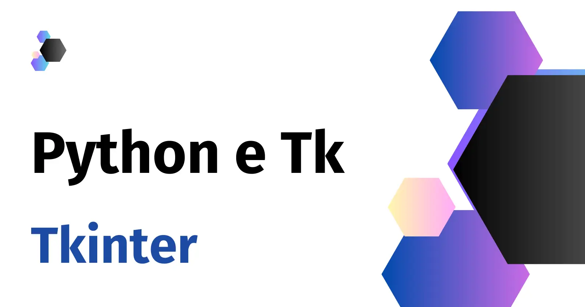

:og:site_name: Python e Tkinter - justCode
:og:author: Renato Cruz (natorsc)
:og:type: site
:og:image: ../images/python-tkinter-1600x840.webp
:og:title: Criando interfaces gráficas com Python e Tkinter
:og:description: Documentação criada centralizar dicas, tutoriais e exemplos de código sobre a construção de interfaces gráficas com a linguagem de programação Python e a bliblioteca gráfica Tkinter.

.. meta::
   :title: Criando interfaces gráficas com Python e Tkinter
   :author: Renato Cruz (natorsc)
   :description: Documentação criada centralizar dicas, tutoriais e exemplos de código sobre a construção de interfaces gráficas com a linguagem de programação Python e a bliblioteca gráfica Tkinter.
   :keywords: Python, Python 3, Tkinter, Tk, Ttk, Tcl,

   Criando interfaces gráficas com Python e Tkinter

================================================
Criando interfaces gráficas com Python e Tkinter
================================================

História
========

Adentrando o universo da programação gráfica em Python, encontramos uma ferramenta que se destaca pela sua simplicidade e poder: Tkinter.

A história dessa biblioteca remonta aos primórdios do Python, quando seu criador, Guido van Rossum, sentiu a necessidade de integrar interfaces gráficas nativas à linguagem.

Assim, Tkinter nasceu como um conjunto de ligação para o toolkit Tcl/Tk, tornando-se uma peça fundamental no arsenal dos desenvolvedores Python.

Vantagens
=========

Tkinter brilha não apenas pela sua simplicidade, mas também por suas vantagens intrínsecas.

Sua inclusão na biblioteca padrão do Python garante que esteja prontamente disponível, não requerendo instalações adicionais.

Além disso, a curva de aprendizado suave torna Tkinter acessível mesmo para aqueles que estão dando os primeiros passos na programação gráfica.

Projetos que Utilizam
=====================

Tkinter tem uma presença notável em uma variedade de projetos. Desde pequenas ferramentas de automação de tarefas até aplicações desktop mais complexas, Tkinter se destaca como uma escolha confiável.

Projetos como IDLE (o ambiente de desenvolvimento integrado padrão do Python) e o software educacional `Thonny <https://thonny.org/>`__ demonstram a versatilidade e robustez do Tkinter em contextos diversos.

Ao mergulharmos no universo do Tkinter, encontramos não apenas uma biblioteca, mas um aliado confiável na construção de interfaces gráficas poderosas e elegantes em Python.

Sumário
=======

.. toctree::
   :maxdepth: 2
   :caption: Sumário

   tk-widgets
   ttk-widgets
   contribute
