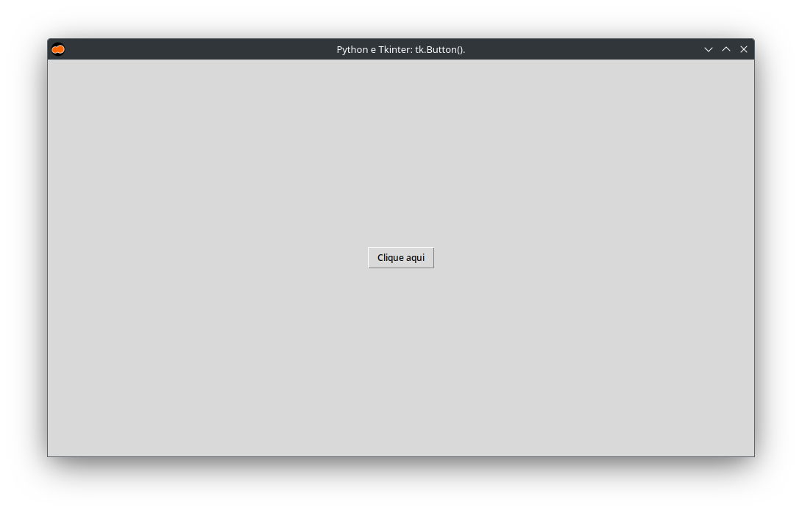
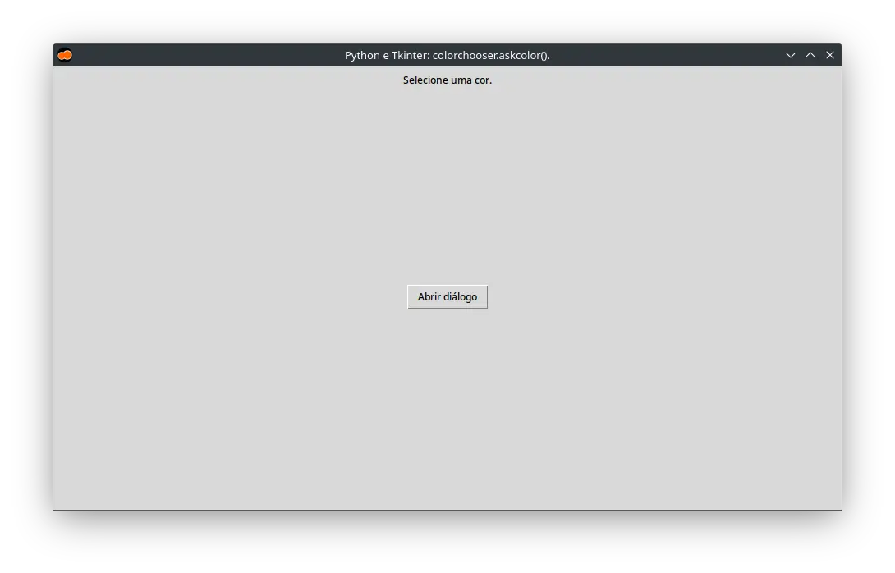
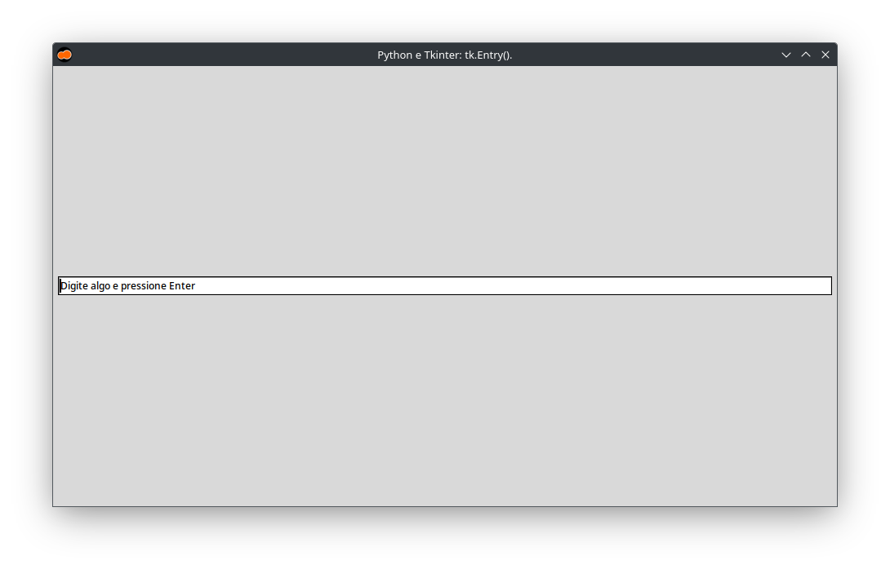
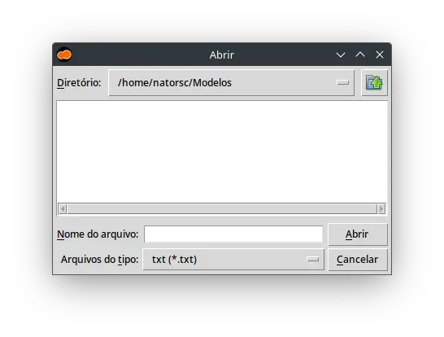

:og:site_name: Tk widgets - Exemplos de código - justCode
:og:author: Renato Cruz (natorsc)
:og:type: article
:og:image: ../images/python-tkinter-1600x840.webp
:og:title: Tk widgets - Exemplos de código - justCode
:og:description: Exemplos de código sobre construção de interfaces gráficas com a linguagem de programação Python e Tkinter.

.. meta::
   :title: Tk widgets - Exemplos de código - justCode
   :author: Renato Cruz (natorsc)
   :description: Exemplos de código sobre construção de interfaces gráficas com a linguagem de programação Python e Tkinter.
   :description lang=en: Code examples on building graphical interfaces with the Python programming language and Tkinter
   :keywords: Python, Python 3, Tkinter, Tk, Ttk, Tcl,

==
Tk
==

widgets
=======

button
------

   Tkinter button

..  literalinclude:: ../../src/tk-widgets/button/MainWindow.py

colorchooser.askcolor
---------------------

   Tkinter color chooser ask color

..  literalinclude:: ../../src/tk-widgets/color-chooser-ask-color/MainWindow.py

entry
-----

   Tkinter entry

..  literalinclude:: ../../src/tk-widgets/entry/MainWindow.py

filedialog.askopenfile
----------------------

   Tkinter file dialog ask open file

..  literalinclude:: ../../src/tk-widgets/file-dialog-ask-open-file/MainWindow.py
